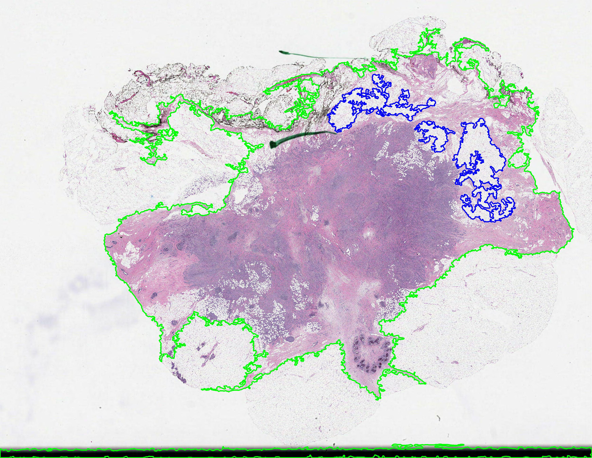
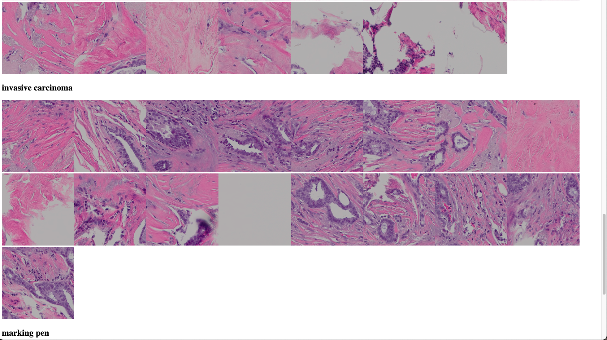

# Mussel commands

This document provides a more detailed reference to the command-line tools provided by
Mussel.


## Commands

Mussel provides handful of CLI tools:

* `tessellate` - tiling and foreground detection
* `extract_features` - generate embeddings with a pathology foundation model 
* `filter_features` - 
* `cache_tiles`
* `stitch_tiles`
* `annotate`
* `create_class_embeddings`
* `merge_annotation_features`
* `linear_probe_benchmark`
* `export_tiles`

Each of these commands is configurable with a number of different parameters, which are summarized
further below.  You can always get a quick list of the parameters and default values for a given tool
by executing `<command> --help`.

### Examples



The example commands below use the test data provided in the `tests/testdata` folder. 


### `tessellate`

Tessellate tiles a whole-slide image.  The tile coordinates and other metadata necessary
for downstream steps are written to an HDF5 (.h5) file.

Example command (see defaults with `tessellate --help`):
```bash
tessellate \
    slide_path=tests/testdata/948176.svs \
    output_h5_path=948176_coord.h5 \
    seg_config.segment_threshold=0 \
    num_workers=1
```

### `extract_features`

Use a pathology foundation model to calculate feature embeddings for a slide tiled using
the `tessellate` commaand described above.  This generates both an HDF5 (.h5) file and
a PyTorch (.pt) file, with embeddings for each tile.

The following models are currently supported,

|| Model       || model_type || Reference ||
| ResNet-50     | RESNET50    | https://huggingface.co/microsoft/resnet-50 |
| TransPath     | CTRANSPATH  | https://github.com/Xiyue-Wang/TransPath |
| Prov-GigaPath | GIGAPATH    | https://github.com/prov-gigapath/prov-gigapath |
| Virchow       | VIRCHOW     | https://huggingface.co/paige-ai/Virchow |
| H-Optimus-0   | OPTIMUS     | https://huggingface.co/bioptimus/H-optimus-0 |
| OpenCLIP      | CLIP        | https://github.com/mlfoundations/open_clip |
| GooglePath    | GOOGLEPATH  | https://huggingface.co/google/path-foundation | 

OpenCLIP is used by default.  Use the `model_type` parameter to specify a different model.
To use H-Optimus-0, for example,

```bash
extract_features \
    slide_path=tests/testdata/948176.svs \
    patch_h5_path=948176_coord.h5 \
    model_type=OPTIMUS \
    output_h5_path=948176_feat.h5 \
    output_pt_path=948176_embed.pt
```

Most of the supported models download from HuggingFace, except for CTransPath and the
ResNet-50 model.  Three of the HuggingFace models (Prov-Gigapath, GooglePath, and Virchow)
are "gated", and to use these you need to sign an agreement on the HuggingFace site and
have your HuggingFace access token in the HF_TOKEN environment variable.


Finally, you can generate features from a folder of pre-tiled images, specifying the
folder using `patch_path` parameter.
```bash
extract_features \
    slide_path=None \
    patch_h5_path=None \
    patch_path=<path to folder w/ tiles in image format (.tif, .png, .jpg, etc.)> \
    output_h5_path=<path to output h5 file> \
    output_pt_path=None
```

### `create_class_embeddings` and `annotate`

You can generate embeddings for different tissue types, using the QuiltNet OpenClip model, and
use these to annotate a set of tiles for which you have OpenClip embeddings. 

The `tests/testdata/` folder includes some emmbeddings generated for the following tissue
types,

* "carcinoma in situ"
* "invasive carcinoma with lymphocytes"
* "tumor infiltrating lymphocytes"
* "lymphocytes"
* "carcinoma in situ with lymphocytes"
* "tumor-associated stroma with lymphocytes"

You can apply these to the sample slide with the command

```bash
annotate \
    features_pt_path=tests/testdata/948176.features.pt \
    class_embedding_pt_path=tests/testdata/class_embedding.pt \
    classes='["carcinoma in situ","invasive carcinoma","collagenous stroma","adipose","vessel","necrosis", "invasive adenocarcinoma","sarcoma"]' \
    output_csv_path=948176.annotations.csv 
```

### `create_class_embeddings`

You can also define your own classes with OpenClip! Any natural language works, and no training is required.  For example,

```bash
create_class_embeddings \
    classes='["carcinoma in situ","invasive carcinoma with lymphocytes","tumor infiltrating lymphocytes","lymphocytes","carcinoma in situ with lymphocytes","tumor-associated stroma with lymphocytes"]' \
    output_pt_path=my_classes.pt

annotate \
    features_pt_path=tests/testdata/948176.features.pt \
    class_embedding_pt_path=my_classes.pt \
    classes='["carcinoma in situ","invasive carcinoma with lymphocytes","tumor infiltrating lymphocytes","lymphocytes","carcinoma in situ with lymphocytes","tumor-associated stroma with lymphocytes"]' \
    output_csv_path=948176.annotations-my-classes.csv
```



### `cache_tiles`

Generate PyTorch (.pt) file for rapid access of tiles during I/O intense operations such
as training. This can be conditioned on tissue types: e.g. cache only the tiles
containing invasive carcinoma by setting `limit_to_class`. `patches_h5_path` is
the output from `tessellate`.

```bash
cache_tiles slide_path=data/948176.svs \
    patch_h5_path=reef/948176_coord.h5 \
    output_pt_path=reef/948176_cache.pt \
    'limit_to_class=["carcinoma in situ", "invasive carcinoma with lymphocytes"]' \
    output_indices_json_path=reef/948176_output_indices.json
```

*This takes about ten seconds for an example slide.*


