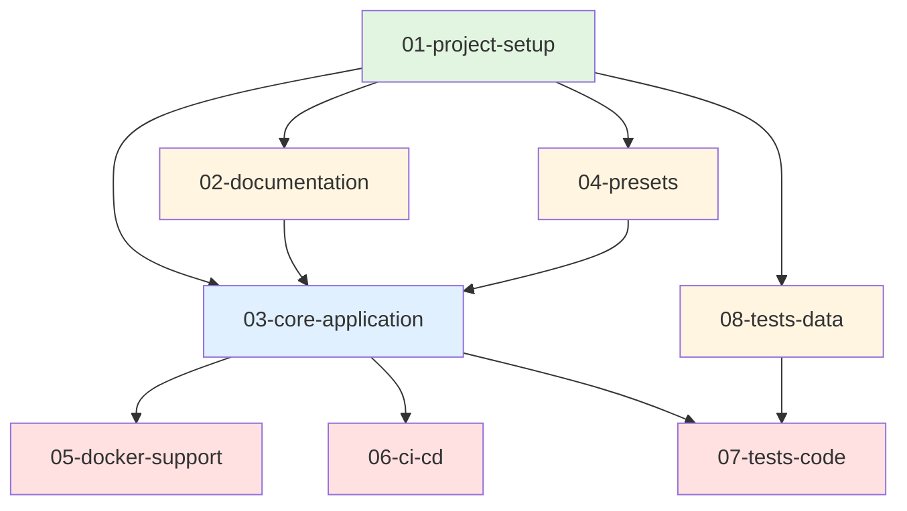

# Branch Separation Summary

## Overview
The original monolithic PR (77 files, 12,474+ insertions) has been successfully separated into **8 manageable branches**.

## Visual Overview

```
┌─────────────────────────────────────────────────────────────────┐
│  Original PR: 91c4977 - "Delete mussel/datasets/tensor.py"     │
│  77 files, 12,474+ insertions                                   │
└─────────────────────────────────────────────────────────────────┘
                                    │
                                    ▼
        ┌───────────────────────────────────────────────┐
        │         SEPARATED INTO 8 BRANCHES              │
        └───────────────────────────────────────────────┘
                                    │
        ┌───────────────────────────┴────────────────────────────┐
        │                                                         │
        ▼                                                         ▼
┌──────────────────┐                                    ┌──────────────────┐
│  Phase 1: Base   │                                    │  Phase 2: Docs   │
└──────────────────┘                                    └──────────────────┘
        │                                                         │
        ▼                                                         ▼
  01-project-setup                               ┌────────────────┼────────────────┐
    (6 files)                                    │                │                │
        │                                        ▼                ▼                ▼
        │                                 02-documentation  04-presets    08-tests-data
        │                                   (10 files)      (3 files)      (8 files)
        │                                        │                │                │
        └────────────────────────────────────────┴────────────────┴────────────────┘
                                                 │
                                                 ▼
                                    ┌────────────────────────┐
                                    │  Phase 3: Core Code    │
                                    └────────────────────────┘
                                                 │
                                                 ▼
                                        03-core-application
                                          (28 files)
                                                 │
                                                 ▼
                                    ┌────────────────────────┐
                                    │  Phase 4: Support      │
                                    └────────────────────────┘
                                                 │
                        ┌────────────────────────┼────────────────────────┐
                        │                        │                        │
                        ▼                        ▼                        ▼
                 05-docker-support          06-ci-cd              07-tests-code
                    (4 files)               (3 files)               (15 files)
```

## File Distribution

| Branch | Files | Lines | Description |
|--------|-------|-------|-------------|
| 01-project-setup | 6 | 3,987+ | Project configuration files |
| 02-documentation | 10 | 1,506+ | Documentation and images |
| 03-core-application | 28 | 3,963+ | Core code: datasets, models, utils, CLI |
| 04-presets | 3 | 6 | Configuration presets |
| 05-docker-support | 4 | 488+ | Docker files and scripts |
| 06-ci-cd | 3 | 215+ | GitHub Actions workflows |
| 07-tests-code | 15 | 953+ | Test code |
| 08-tests-data | 8 | 1,356+ | Test data files |
| **TOTAL** | **77** | **12,474+** | **Complete project** |

## Dependency Flow



## Merge Timeline

```
Week 1:  ✅ 01-project-setup
         └─> Creates foundation

Week 2:  ✅ 02-documentation
         ✅ 04-presets
         ✅ 08-tests-data
         └─> Independent, can merge in parallel

Week 3:  ✅ 03-core-application
         └─> Main application code

Week 4:  ✅ 05-docker-support
         ✅ 06-ci-cd
         ✅ 07-tests-code
         └─> Supporting infrastructure, can merge in parallel
```

## Key Benefits

### 📊 **Smaller PRs**
- Average: 9-10 files per branch
- Largest: 28 files (core-application)
- Smallest: 3 files (presets, ci-cd)

### 👥 **Parallel Review**
- 3 branches in Phase 2 can be reviewed simultaneously
- 3 branches in Phase 4 can be reviewed simultaneously
- Faster overall review process

### 🎯 **Focused Scope**
- Each branch has a single, clear purpose
- Easier to understand and review
- Reduced cognitive load

### 🔗 **Clear Dependencies**
- Explicit dependency chain
- No merge conflicts
- Logical build-up of functionality

### ⚡ **Flexible Merging**
- Can merge approved branches immediately
- Don't have to wait for entire PR
- Issues in one branch don't block others

## Status

- [x] Branch separation design completed
- [x] Documentation created
- [ ] Branches created and pushed to GitHub (run `./create-and-push-branches.sh`)
- [ ] Pull requests created
- [ ] Reviews in progress
- [ ] Branches merged

## Quick Start

```bash
# 1. Create and push all branches to GitHub
./create-and-push-branches.sh

# 2. Create PRs in order (see NEXT_STEPS.md)

# 3. Review and merge following the dependency order
```

For detailed information, see:
- **BRANCH_SEPARATION_PLAN.md** - Complete plan
- **BRANCH_QUICK_REFERENCE.md** - Quick reference
- **NEXT_STEPS.md** - What to do next
