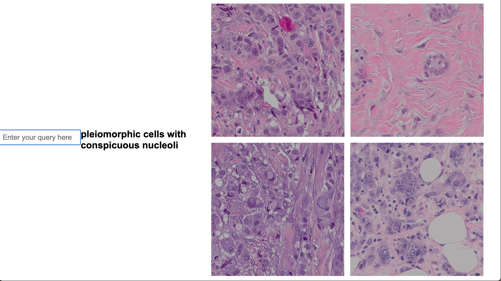
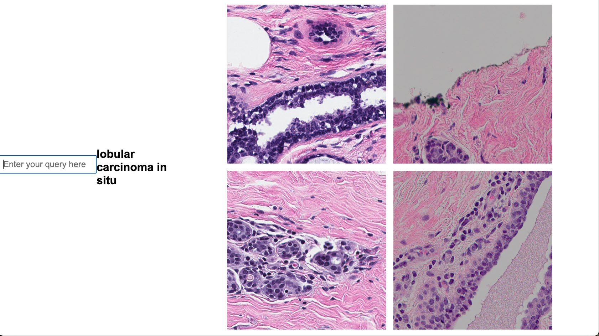

# Mussel


This is a fork of Faisal Mahmood's CLAM repository (GPL v3 license), with the following modifications:
- Added CTransPath and Quilt embeddings
- Added zero-shot tissue-type annotation of tiles
- Added browser for text-to-image AI search of MSK pathology data
- Added caching of images for inference right on the tiles (rather than on embeddings)
- Added microns per pixel (mpp) as parameter for tiling, supported regardless of native slide resolution
- Made usable for job submission (one script run, one slide)
- Removed modeling

Usable using Condor, but suffers from limitations of current Condor system:
- sporadic data accessibility (e.g. sparky2 cannot access `/gpfs/mskmind_emc/data_large`)
- uncontrolled GPU usage by non-Condor usage (e.g. user was using most gpus across pll1,2,3 without Condor when I tried to test the featurization using Condor, so mine largely failed due to clashes.)

## setup
```bash
conda create --name mussel -c conda-forge \
openslide-python numpy pandas opencv h5py matplotlib

conda activate mussel
conda install pytorch torchvision pytorch-cuda=12.1 \
-c pytorch -c nvidia
conda install -c conda-forge opencv
```

### If you plan to use CTransPath
Download modified timm from [here](https://drive.google.com/file/d/1JV7aj9rKqGedXY1TdDfi3dP07022hcgZ/view)
```bash
pip install timm-0.5.4.tar
```

### If you plan to use Quilt
- install open-clip
```bash
conda install -c conda-forge sentencepiece
pip install open-clip-torch
pip install transformers
```
- edit argument name to work with open_clip checkpoint
  - `vi +180 {conda_path}/envs/mussel/lib/python3.12/site-packages/open_clip/model.py`
  - add the following lines 180-181:
```python
179     if isinstance(text_cfg, dict):
180         text_cfg['hf_proj_type'] = text_cfg.pop('proj')
181         text_cfg['hf_pooler_type'] = text_cfg.pop('pooler_type')
182         text_cfg = CLIPTextCfg(**text_cfg)
```

### enroll your images to the reef
- build a CSV file like so:
```
image_id,slide_file
001,/my/path/to/001.svs
002,/my/path/to/002.svs
...
```
- run 
```
python enroll.py csv_file.csv
```
The reef is the centralized repository for slides and their location on disk. This dramatically reduces the burden of taking care of paths and co-registering the downstream files. Mussel handles it all consistently and, given a list of slides of interest to you, avoids duplicate calculations if someone else has already examined the same slide.

If your images are not enrolled in the reef or you are outside MSK, there are separate files for each command (e.g. `tessellate.py` instead of `main.py tessellate`) where you can manually specify exact file paths for input and output.


## foreground detection and tiling

Generate .h5 file with coordinates and metadata necessary for downstream steps, using the following arguments
- mpp (microns per pixel)
- step_size (distance between patches)
- patch_size (edge length of patch, must be 224 for CTransPath or Quilt)
- save_dir (directory with or in which to create {masks,stitches,patches} subdirectories)

The patches directory contains the actual h5 file with coordinates and metadata required for downstream use. For quality control, masks show the tissue area, stitches show the tiling pattern.
```bash
python main.py tessellate 
--image_id {image-id} \
--mpp 1.0 \
--step_size 224 \
--patch_size 224
```
*This takes about one second for an example slide. Using Condor, tiling 1000 slides takes about two minutes.*

## feat extraction
Generate .h5 file and .pt file with embeddings for each tile, using the following arguments
- model (resnet50 or ctranspath)
- save_dir (directory with or in which to create {h5_files,pt_files} subdirectories)

The h5_files directory contains the h5 file with embeddings (N_tiles x 768 or 1024), the pt_files directory contains the pt file with embeddings.

```bash
python main.py featurize \
--image_id {image-id} \
--model_name {quilt,resnet50,ctranspath} \
--gpus 0 \
--batch_size 128 \
--mpp 1.0 \
--step_size 224 \
--patch_size 224
```

*This takes about 30 seconds for an example slide.*

## annotate tiles with tissue types (beta feature)
Current classes are 
```
{"0": "benign epithelium", "1": "carcinoma in situ", "2": "invasive carcinoma", "3": "connective tissue", "4": "adipose", "5": "vessel", "6": "necrosis", "7": "marking pen"}
```

Try your own classes! Any natural language works, and no training is required. Generate interrogation reports to eval your prompt engineering.
```bash
python main.py annotate \
--image_id {image-id} \
--mpp 1.0 \
--step_size 224 \
--patch_size 224
--interrogate # this flag is slow; for spot checks
```


When you're satsified, run `annotate.py` without the interrogation options on your cohort at scale.

## tile caching
Generate .pt file for rapid access of tiles during I/O intense operations such as training. This can be conditioned on tissue types: e.g. cache only the tiles containing invasive carcinoma.
```bash
python main.py cache \
--image_id {image-id} \
--mpp 1.0 \
--step_size 224 \
--patch_size 224
--limit_to_class "adipose"  # replace spaces by _ for condor_main.py
```

*This takes about ten seconds for an example slide.*

## image search (beta feature)
Browse the slides in the Mussel reef, using text-to-image search.
```bash
python foundational_inference/app.py {device}
```

Open the displayed IP address in your browser. Search for anything using natural language.




Currently limited to about 1,000 slides with breast cancer. Works best on a GPU.

## License
This code is made available under the GPLv3 License and is available for non-commercial academic purposes.
Forked from CLAM, © [Mahmood Lab](http://www.mahmoodlab.org).

## Reference

Please cite the original CLAM [paper](https://www.nature.com/articles/s41551-020-00682-w):

Lu, M.Y., Williamson, D.F.K., Chen, T.Y. et al. Data-efficient and weakly supervised computational pathology on whole-slide images. Nat Biomed Eng 5, 555–570 (2021). https://doi.org/10.1038/s41551-020-00682-w

```
@article{lu2021data,
  title={Data-efficient and weakly supervised computational pathology on whole-slide images},
  author={Lu, Ming Y and Williamson, Drew FK and Chen, Tiffany Y and Chen, Richard J and Barbieri, Matteo and Mahmood, Faisal},
  journal={Nature Biomedical Engineering},
  volume={5},
  number={6},
  pages={555--570},
  year={2021},
  publisher={Nature Publishing Group}
}
```
