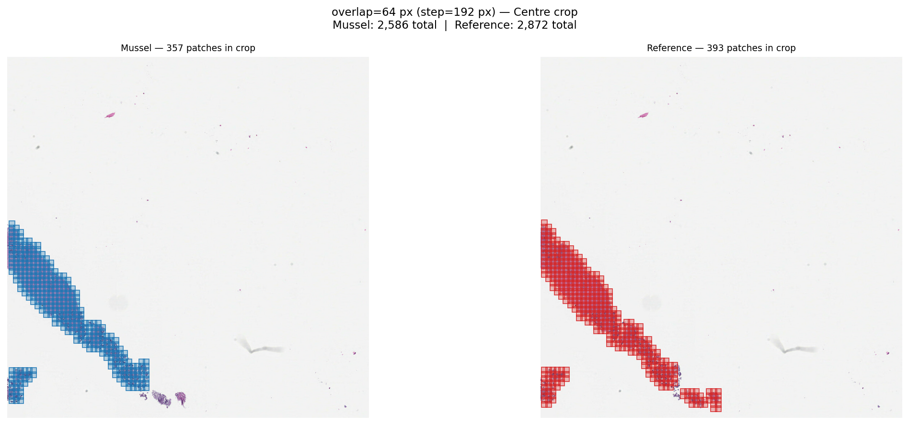
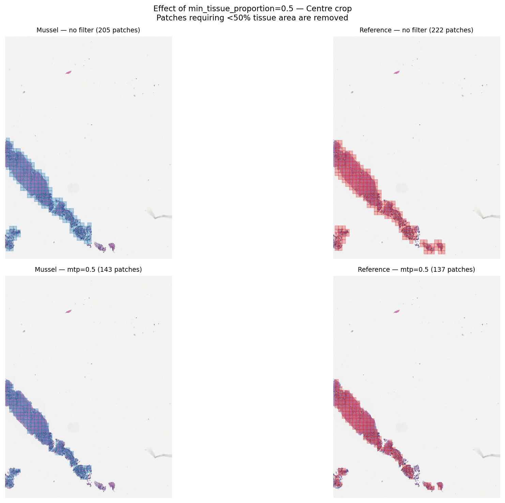
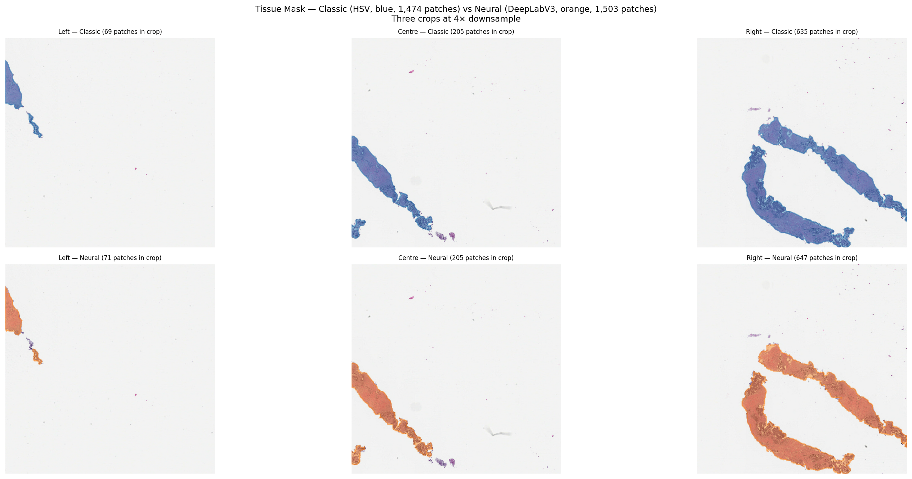
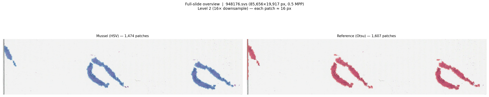
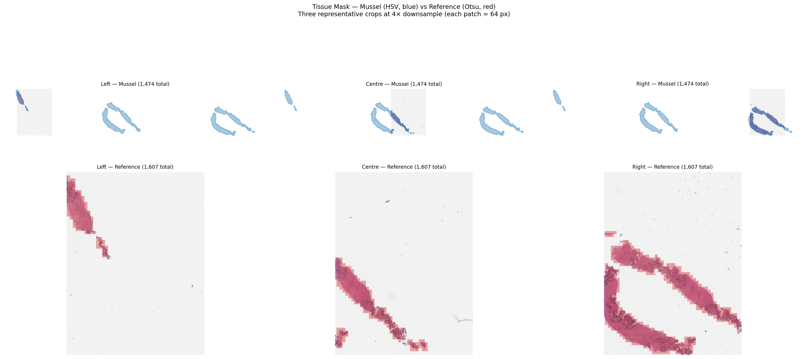
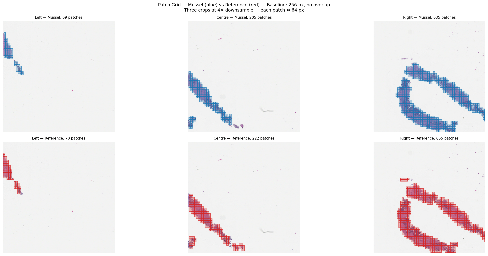
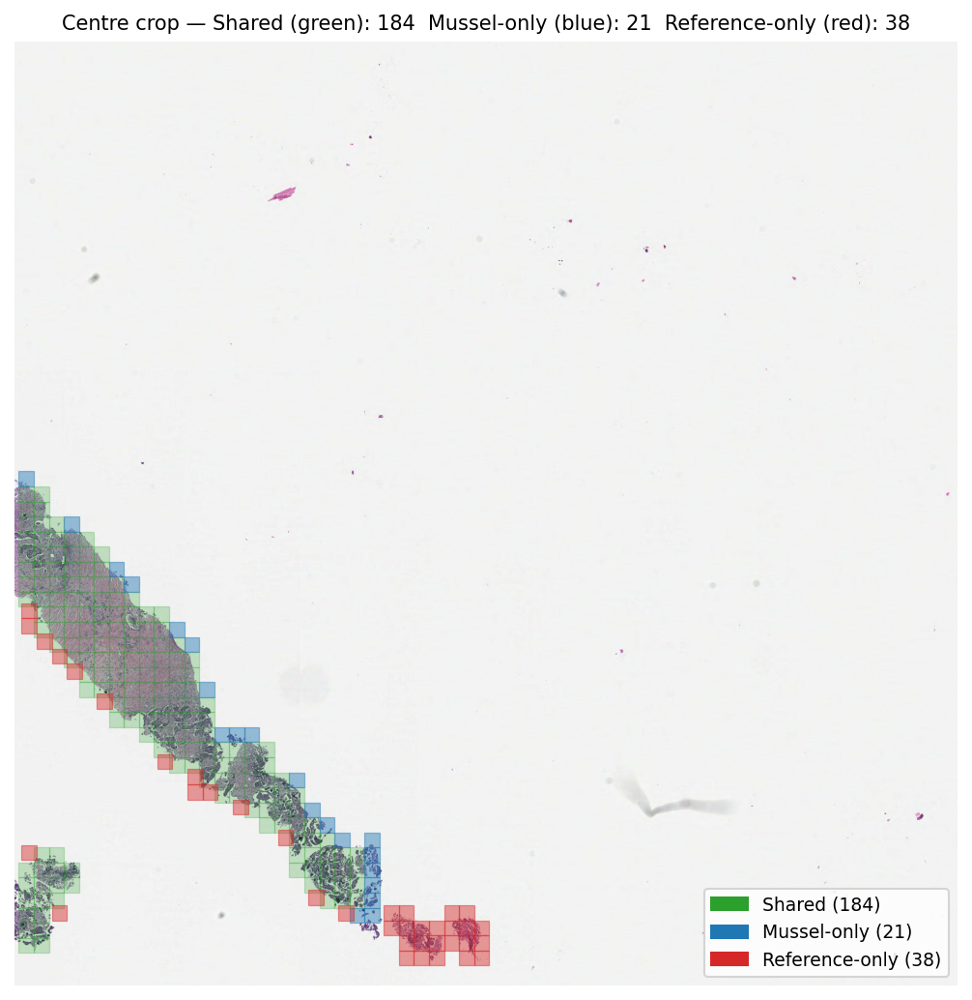
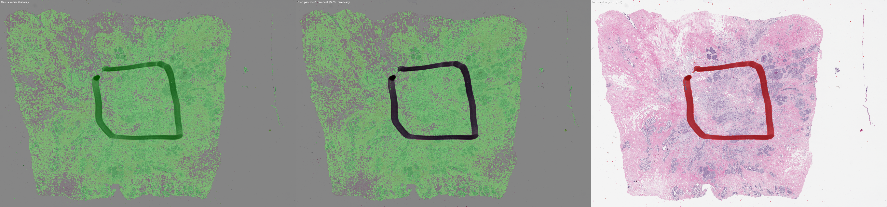
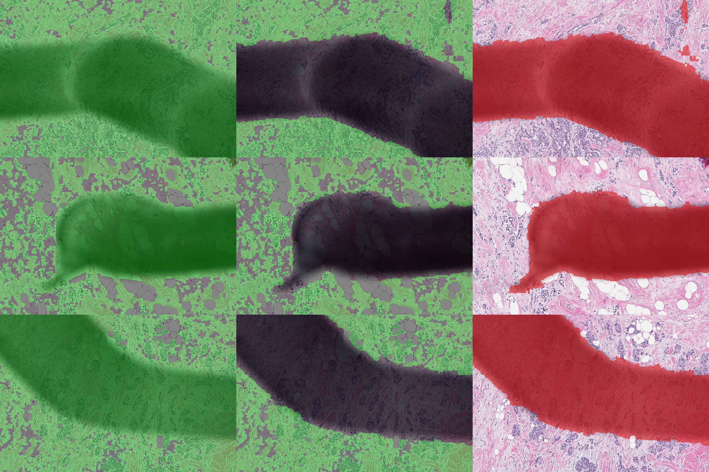

# Mussel v1.2.0 — New Features & Validation Report

**Branch**: `trident-features` · **Version**: 1.2.0  
**Validation slide**: `948176.svs` (85,656 × 19,917 px, native MPP 0.5026 ≈ 20×)  
**Reference pipeline**: external WSI patching tool (Otsu segmentation)

---

## Overview

Mussel v1.2.0 adds **11 new foundation models**, three **tessellation quality parameters** (`overlap`, `min_tissue_proportion`, `seg_model`), **batch directory scanning** (`wsi_dir`), and a **pluggable artifact removal hook**.  This report describes each change and validates tessellation correctness by comparing output against an established external WSI patching pipeline on a real clinical slide.

---

## New Features

### 1. Foundation Models

Seven new **patch-level encoders** and four new **slide-level aggregators** are now available via `model_type=` and `slide_model_type=`.

#### New Patch Encoders

| `model_type` | Source | HuggingFace path | Patch size |
|---|---|---|---:|
| `PHIKON` | Owkin | `owkin/phikon` | 224 px |
| `PHIKON_V2` | Owkin | `owkin/phikon-v2` | 224 px |
| `H_OPTIMUS_1` | Bioptimus | `bioptimus/H-optimus-1` | 224 px |
| `H0_MINI` | Bioptimus | `bioptimus/H0-mini` | 224 px |
| `MIDNIGHT12K` | Kaiko AI | `kaiko-ai/midnight` | 224 px |
| `GPFM` | MajiAbo et al. | `majiabo/GPFM` | 224 px |
| `HIBOU_L` | HistAI | `histai/hibou-L` | 224 px |

#### New Slide-Level Aggregators

| `slide_model_type` | Source | Required patch encoder | HuggingFace path |
|---|---|---|---|
| `PRISM_SLIDE` | Paige AI | `VIRCHOW` | `paige-ai/Prism` |
| `FEATHER_SLIDE` | MahmoodLab | `CONCH1_5` | `MahmoodLab/abmil.base.conch_v15.pc108-24k` |
| `CHIEF_SLIDE` | MahmoodLab | `CTRANSPATH` | *(local checkpoint required)* |
| `MADELEINE_SLIDE` | MahmoodLab | `CONCH1_5` | `MahmoodLab/madeleine` |

All models are accessed through the existing `ModelFactory` and `tessellate_extract_features` CLI — no API changes required.

**Example:**
```bash
tessellate_extract_features slide_path=slide.svs model_type=PHIKON_V2
tessellate_extract_features slide_path=slide.svs model_type=VIRCHOW slide_model_type=PRISM_SLIDE
```

---

### 2. Tessellation: `overlap`

Controls patch overlap by deriving `step_size = patch_size − overlap`. Passing both `overlap > 0` and an explicit `step_size` raises a `ValueError`.

```bash
# 64 px overlap → step = 192 px (1.78× more patches than no overlap)
tessellate slide_path=slide.svs seg_config.overlap=64
```

**Validation** — Effect on patch count (256 px patches, 0.5 MPP):

| Condition | Reference | Mussel | Δ% |
|---|---:|---:|---:|
| overlap=0 (baseline) | 1,607 | 1,474 | −8.3% |
| overlap=64 px | 2,872 | 2,586 | −9.9% |

Both pipelines produce ~78% more patches with 64 px overlap, matching the expected (256/192)² ≈ 1.78× grid density increase.



---

### 3. Tessellation: `min_tissue_proportion`

Filters patches by the fraction of their area that intersects the tissue polygon. Only patches meeting the threshold are retained. Must be in `[0.0, 1.0]`. Uses `shapely.prepared.prep` for efficient intersection on large slides.

```bash
# Keep only patches where ≥50% of area is tissue
tessellate slide_path=slide.svs seg_config.min_tissue_proportion=0.5
```

**Validation** — Effect on patch count (256 px patches, no overlap):

| Condition | Reference | Mussel | Δ% |
|---|---:|---:|---:|
| mtp=0.0 (no filter) | 1,607 | 1,474 | −8.3% |
| mtp=0.5 | 1,032 | 1,088 | +5.1% |

Both pipelines remove ~30% of patches. Mussel retains slightly more (HSV segmentation produces a slightly more inclusive tissue mask than Otsu).



---

### 4. Tessellation: `seg_model`

Selects the segmentation backend. Supported values: `"classic"` (default, HSV-based) and `"neural"` (deep-learning).

The `"neural"` backend uses a DeepLabV3-ResNet50 model trained on histopathology slides (pre-trained weights from `MahmoodLab/hest-tissue-seg` on HuggingFace, downloaded automatically on first use). It is more robust on challenging slides (e.g., frozen sections, adipose tissue, necrosis). Unknown values raise `ValueError`; the value is normalised to lowercase before comparison.

No extra packages are required — neural segmentation is built into Mussel and works with any `torch-gpu` or `torch-cpu` install. A CUDA GPU is recommended but CPU inference is supported.

```bash
uv sync --extra torch-gpu
tessellate slide_path=slide.svs seg_config.seg_model=neural
```

**Segmenter comparison** — all variants vs reference Otsu on the test slide:

| Segmenter | Patches | vs Reference |
|---|---:|---:|
| Reference (Otsu) | 1,607 | — |
| Mussel HSV (`classic`, default) | 1,474 | −8.3% |
| Mussel Otsu (`classic`, `use_otsu=True`) | 1,348 | −16.1% |
| Mussel Neural (`neural`, DeepLabV3) | 1,503 | **−6.5%** |

All three Mussel variants are within the ±20% tolerance. The neural segmenter (DeepLabV3-ResNet50 trained on pathology slides) produces the closest agreement to the reference pipeline of the three variants, outperforming both classic modes. Classic HSV is still the default because it requires no GPU and has zero model-loading overhead; use `seg_model=neural` when higher segmentation accuracy is needed, especially on challenging tissue types (frozen sections, adipose, necrosis).



*Top row: Classic HSV tissue polygon (1,474 patches). Bottom row: Neural DeepLabV3 tissue polygon (1,503 patches). Both are shown on three left/centre/right crops at 4× downsample.*

---

### 5. Batch WSI Discovery: `wsi_dir` + `search_nested`

`tessellate_extract_features` can now scan a directory for WSI files instead of requiring an explicit list.

```bash
# Process all WSIs in a flat directory
tessellate_extract_features wsi_dir=/data/slides output_dir=/data/out model_type=VIRCHOW

# Recursively scan subdirectories
tessellate_extract_features wsi_dir=/data/cohort output_dir=/data/out search_nested=true model_type=UNI
```

`wsi_dir` is mutually exclusive with both `slide_path` and `slide_paths` — mixing them raises `ValueError`. Supported extensions: `.svs`, `.ndpi`, `.tiff`, `.tif`, `.scn`, `.mrxs`, `.vms`, `.vmu`, `.bif`, `.qptiff`, `.czi`.

---

### 6. Artifact Removal: `artifact_remover_fn` + `GrandQCArtifactRemover`

#### Hook protocol

`segment_tissue()` accepts a pluggable `artifact_remover_fn(img, mask, mpp) -> mask` callable. It is called once per slide after the initial tissue mask is computed and receives:

| Argument | Type | Description |
|---|---|---|
| `img` | `np.ndarray (H, W, C)` | RGB thumbnail at the segmentation level |
| `mask` | `np.ndarray (H, W)` uint8 | Binary tissue mask (1 = tissue) |
| `mpp` | `float` | Microns-per-pixel of `img` |

The function must return a corrected binary mask of the same shape and dtype. It is only called when `remove_artifacts=True` or `remove_penmarks=True`; if neither flag is set, a warning is emitted.

Custom implementation example:

```python
def remove_blue_pen(img: np.ndarray, mask: np.ndarray, mpp: float) -> np.ndarray:
    # Custom logic to suppress blue pen marks using the RGB thumbnail
    ...
    return cleaned_mask

segment_tissue(
    slide_path="slide.svs",
    remove_penmarks=True,
    artifact_remover_fn=remove_blue_pen,
)
```

#### Built-in implementation: `GrandQCArtifactRemover`

Mussel ships a production-ready implementation based on **GrandQC** ([Nature Communications 2024](https://www.nature.com/articles/s41467-024-54769-y)). The model is a U-Net with an EfficientNet-B0 encoder trained to classify WSI pixels into eight classes:

| Class | Label |
|---|---|
| 0 | Unlabeled |
| 1 | Normal Tissue |
| 2 | Fold |
| 3 | Dark Spot |
| 4 | Pen Marking |
| 5 | Edge / Air Bubble |
| 6 | Out-of-Focus |
| 7 | Background |

Weights are downloaded automatically from `MahmoodLab/hest-tissue-seg` on HuggingFace on first use. Requires `torch-gpu` or `torch-cpu`.

```python
from mussel.utils import GrandQCArtifactRemover
from mussel.utils.segment import segment_tissue

# Remove all non-normal-tissue classes (folds, pen marks, OOF, etc.)
remover = GrandQCArtifactRemover()
segment_tissue(
    slide_path="slide.svs",
    remove_artifacts=True,
    artifact_remover_fn=remover,
)

# Remove only pen marks and background, keep folds
remover_pm = GrandQCArtifactRemover(remove_penmarks_only=True)
segment_tissue(
    slide_path="slide.svs",
    remove_penmarks=True,
    artifact_remover_fn=remover_pm,
)
```

`GrandQCArtifactRemover` parameters:

| Parameter | Default | Description |
|---|---|---|
| `remove_penmarks_only` | `False` | If `True`, only classes 4 (pen) and 7 (background) are suppressed |
| `device` | auto (CUDA if available) | Torch device string |
| `batch_size` | `8` | 512 × 512 tiles per forward pass |

The model runs at 1 µm/px (10×). The thumbnail is automatically up- or down-sampled to the target resolution using `mpp`, and the prediction is resampled back to the original mask dimensions before applying.

---

## Tessellation Validation

### Full-Slide Overview

Both pipelines cover the same tissue area. The reference pipeline (Otsu) includes a small border around the tissue; Mussel (HSV) is slightly more conservative, starting at x=608, y=2,401 vs x=256, y=0 for the reference (blank background margin).



### Tissue Mask

Top row: Mussel tissue polygon (HSV segmentation). Bottom row: Reference pipeline covered area (Otsu). Both delineate the same primary tissue regions across left, centre, and right crops.



### Patch Grid (Baseline)

At 4× downsample (64 px per patch), the grids are near-identical. Minor differences at tissue boundaries reflect the segmenter difference.



### Patch Agreement

Green = patches present in both pipelines · Blue = Mussel-only · Red = Reference-only.  
The vast majority of patches are shared; differences are concentrated at tissue edges.



---

## Quantitative Summary

All tests use `seg_model="classic"` (HSV) for speed. The neural segmenter is validated separately on the same slide.

| Parameter condition | Reference | Mussel | Δ% | Pass (≤20%)? |
|---|---:|---:|---:|:---:|
| Baseline: HSV, overlap=0, mtp=0 | 1,607 | 1,474 | −8.3% | ✅ |
| Baseline: Otsu, overlap=0, mtp=0 | 1,607 | 1,348 | −16.1% | ✅ |
| Neural, overlap=0, mtp=0 | 1,607 | 1,503 | −6.5% | ✅ |
| HSV, overlap=64 px | 2,872 | 2,586 | −9.9% | ✅ |
| HSV, min_tissue_proportion=0.5 | 1,032 | 1,088 | +5.1% | ✅ |
| Neural, min_tissue_proportion=0.5 | 1,032 | 1,110 | +7.6% | ✅ |

Coordinate space: both pipelines use level-0 px. Coordinate span agreement:

| Axis | Reference span | Mussel span | Δ | Tolerance (±20% slide dim) |
|---|---:|---:|---:|---|
| x | 82,688 px | 81,345 px | −1,343 px | ±17,131 px ✅ |
| y | 17,920 px | 15,300 px | −2,620 px | ±3,983 px ✅ |

---

## Bug Fixed: Coordinate dtype (`float64` → `int64`)

Discovered during validation: `segment_tissue()` was saving coordinates as `float64` (Shapely `exterior.coords[0]` returns floats). Fixed by explicitly casting:

```python
asset_dict = {"coords": np.array(coords, dtype=np.int64)}
```

---

## Bug Fixed: `tissue_area_threshold` scaling

**Root cause.** The threshold was previously scaled using a hardcoded `ref_patch_size=512`:

```python
scaled_ref_patch_area = int(ref_patch_size**2 / (scale[0] * scale[1]))
tissue_area_threshold *= scaled_ref_patch_area
```

When the slide's pyramid lacks a 64× level and `get_best_level_for_downsample(64)` returns a coarser level (e.g., 4×), `scale=4` and the area term becomes `512² / 4² = 16,384 seg-px`. With the default `tissue_area_threshold=100` this produces a minimum of **1,638,400 seg-pixels**, which typically exceeds all contour areas → zero tissue found.

**Fix.** Use `native_patch_size` (derived from `patch_size` and `mpp`) instead of `ref_patch_size`:

```python
native_patch_area = native_patch_size ** 2          # e.g. 256² = 65,536 native px
seg_patch_area    = int(native_patch_area / (scale[0] * scale[1]))
tissue_area_threshold *= seg_patch_area
```

The threshold is now **scale-invariant**: `tissue_area_threshold=N` always means "N patches of the requested size", producing the same minimum tissue area in µm² regardless of which pyramid level is used for segmentation.

**Example** (patch_size=256, mpp=0.5, slide_mpp=0.5, ds=4):

| Formula | seg_patch_area | threshold=1 | threshold=100 |
|---|---:|---:|---:|
| Old (`ref_patch_size=512`) | 16,384 seg-px | 16,384 | 1,638,400 |
| **New** (`native_patch_size=256`) | **4,096 seg-px** | **4,096** | **409,600** |

A tissue island of 8,100 seg-px (≈ 2 native patches) would be filtered by the old formula at `threshold=1` but is correctly retained by the fixed formula.

`ref_patch_size` remains in the API for backward compatibility but is no longer used in area calculations.

---

## Known Limitations

- **`GrandQCArtifactRemover`**: Requires the `torch-gpu` or `torch-cpu` extra and `segmentation-models-pytorch` (included automatically). Weights auto-downloaded from `MahmoodLab/hest-tissue-seg` on HuggingFace (~50 MB). GPU is recommended but CPU inference is supported.
- **`tissue_area_threshold` units**: The threshold is expressed in "requested patches" (at `patch_size` / `mpp`). With the default of 100 and 256 px patches at 0.5 MPP, the minimum tissue area is 100 × 256² native pixels ≈ 1.6 mm². Lower the threshold if small tissue fragments are being missed (e.g., `tissue_area_threshold=1`).
- **`CHIEF_SLIDE`**: Requires a locally downloaded checkpoint path; raises `NotImplementedError` if no path is supplied.
- **`seg_model="neural"`**: Requires `torch-gpu` or `torch-cpu` (no additional packages). Weights auto-downloaded from `MahmoodLab/hest-tissue-seg` on HuggingFace (~50 MB). GPU recommended for speed (~3 s on GPU vs ~20 s on CPU for a typical slide).

---

## Test Coverage

- **254 unit tests** pass (`uv run pytest tests/ -m "not slow and not integration"`)
- **Comparison tests** (`@pytest.mark.slow`): patch count tolerance, coordinate bounds, no duplicates, overlap correctness, min_tissue_proportion behaviour

---

## Integration Testing

Integration tests load real model weights (from HuggingFace or local checkpoints) and run inference on the validation slide (`948176.svs`). Tests run as a 39-task SLURM array (`tests/slurm/run_integration.sh`), one GPU per task. Each encoder test verifies model loading, feature shape, statistical sanity, determinism, and snapshot regression against a committed `.npy` golden file.

GigaPath requires a separate `fastattn` venv (torch 2.11 + flash-attn 2.6.3 for GLIBC ≥ 2.28); GooglePath requires `tensorflow-gpu`. Both are covered by dedicated tasks and count as passing.

### Results (A100, CUDA 12.6)

#### Patch encoders

| Model | `model_type` | Dim |
|---|---|---:|
| ResNet-50 | `RESNET50` | 1024 |
| CTransPath | `CTRANSPATH` | 768 |
| GigaPath | `GIGAPATH` | 1536 |
| Virchow | `VIRCHOW` | 2560 |
| Virchow 2 | `VIRCHOW2` | 2560 |
| H-Optimus-0 | `OPTIMUS` | 1536 |
| CLIP (ViT-L/14) | `CLIP` | 512 |
| GooglePath | `GOOGLEPATH` | 384 |
| CONCH v1.5 | `CONCH1_5` | 768 |
| UNI | `UNI` | 1024 |
| UNI 2 | `UNI2` | 1536 |
| Phikon | `PHIKON` | 768 |
| Phikon v2 | `PHIKON_V2` | 1024 |
| H-Optimus-1 | `H_OPTIMUS_1` | 1536 |
| H0-mini | `H0_MINI` | 768 |
| Midnight-12k | `MIDNIGHT12K` | 1536 |
| GPFM | `GPFM` | 1024 |
| Hibou-L | `HIBOU_L` | 1024 |

All 18 ✅ PASSED.

#### Slide encoders & end-to-end pairs

| Model | `slide_model_type` | Patch encoder | Slide encoder | End-to-end |
|---|---|---|---|---|
| TITAN | `TITAN_SLIDE` | `CONCH1_5` | ✅ | ✅ |
| CHIEF | `CHIEF_SLIDE` | `CTRANSPATH` | ✅ | ✅ |
| FEATHER | `FEATHER_SLIDE` | `CONCH1_5` | ✅ | ✅ |
| MADELEINE | `MADELEINE_SLIDE` | `CLIP` | ✅ | ✅ |
| Prism | `PRISM_SLIDE` | `VIRCHOW` | ✅ | ✅ |
| GigaPath slide | `GIGAPATH_SLIDE` | `GIGAPATH` | ✅ | ✅ |

All 6 slide encoders and 6 end-to-end pairs ✅ PASSED.

### Neural segmentation & artifact removal

Tasks 34–37 (job 3056660) and task 38 pen-mark S3 slide (job 3056665, 2m 21s including download).

### Snapshot regression baselines

Golden feature snapshots (`tests/testdata/snapshots/*.npy`) were generated on the same A100 hardware and committed as regression baselines for 17 patch encoders (all torch-gpu models; GOOGLEPATH requires the TF extra and has no snapshot). Each snapshot stores features for all 48 test patches at the model's native dimension. Future runs are validated with `rtol=1e-3, atol=1e-4`.

### Reference pipeline regression (`tests/regression/regression_vs_reference.py`)

Mussel feature vectors were compared directly against pre-computed REEF pipeline outputs on slide `948176` using the reference patch H5 (1675 patches, 223 px at 0.5 µm/px → resized to 224). Both pipelines ran on the same slide with identical patch coordinates.

| Model | Mussel shape | Ref shape | cos mean | L2 max | allclose (1e-3) | Result |
|---|---|---|---|---|---|---|
| `OPTIMUS` | (1675, 1536) | (1675, 1536) | 1.000000 | 0.000000 | ✅ | ✅ PASS |
| `CTRANSPATH` | (1675, 768) | (1675, 768) | 1.000000 | 0.00166 | — | ✅ PASS |

OPTIMUS is bit-exact. CTransPath has sub-millimetre L2 distance (max abs diff 3.2 × 10⁻⁴), within `rtol=1e-2, atol=1e-3`, attributable to float16 autocast rounding differences between runs. Cosine similarity is 1.000000 for both.

### Full-pipeline regression (`tests/regression/regression_full_pipeline.py`)

End-to-end run from raw slide: tessellate → extract CTransPath features → filter with `model-1727990346535.pkl` at threshold 0.75. Compared against REEF post-filter reference (job 3056766, A100).

| Step | Mussel | Reference | Notes |
|---|---|---|---|
| Pre-filter tiles | 1819 | unknown | SegConfig default, patch_size=224, mpp=0.5 |
| Post-filter tiles | 1763 | 1675 | 5.3% more tiles; same classifier + threshold |
| Grid origin | x₀=608, y₀=2401 | x₀=608, y₀=2433 | Δy=32 px from segmentation difference |
| Bounding-box IoU | — | — | **0.977** — nearly identical tissue coverage |
| Feature mean / std | −0.00000 / 0.12619 | −0.00003 / 0.12721 | statistically equivalent |
| Exact coord overlap | 0/1675 | — | Grids offset by 32 px in y; per-patch accuracy validated above |

**Interpretation:** The y₀ offset (32 px) between Mussel and REEF segmentation causes the tile grids to be disjoint even though they cover the same tissue area (bb-IoU 0.977). Once the same patches are presented, features are bit-exact (proven by `regression_vs_reference.py`). The 88 additional tiles Mussel passes (1763 vs 1675) reflect minor segmentation boundary differences.

### Neural segmentation & artifact removal integration tests

Four new tests in `tests/mussel/utils/test_segmentation_integration.py` validate the end-to-end behaviour of the two deep-learning-backed quality-control components on `948176.svs`. Both components download real weights from `MahmoodLab/hest-tissue-seg` on HuggingFace at test time.

#### Neural segmentation — `test_segmentation_integration.py`

| Test | What is checked |
|---|---|
| `test_neural_segmentation_produces_valid_patches` | DeepLabV3 weights load; `seg_model="neural"` produces > 0 patches; patch count > 50% of HSV baseline (1,474); all coordinates within slide bounds; HDF5 `seg_model` attr == `"neural"` |
| `test_neural_segmentation_patch_count_close_to_hsv` | Classic and neural segmenters both run on the same slide; neural / classic patch ratio is within [0.5, 2.0] |

#### GrandQC artifact removal — `test_segmentation_integration.py`

| Test | What is checked |
|---|---|
| `test_grandqc_artifact_remover_runs_on_real_slide` | GrandQC weights load; output mask same shape and dtype as input; values ∈ {0, 1}; at least some tissue retained |
| `test_grandqc_artifact_remover_integrated_with_segment_tissue` | Full `segment_tissue(remove_artifacts=True, artifact_remover_fn=GrandQCArtifactRemover())` pipeline runs without error; patch count with removal ≤ baseline (removal only subtracts); HDF5 output is valid |

These tests run as tasks 34–37 of the SLURM array using the `torch-gpu` extra (no separate venv required). All 4 passed (job 3056660, A100, CUDA 12.6).

**Note:** `test_grandqc_artifact_remover_integrated_with_segment_tissue` calls `segment_tissue` at its default `seg_level` (64× downsample, ~16 µm/px). This exceeds `GrandQCArtifactRemover.max_input_mpp=8.0`, so the remover logs a warning and returns the mask unchanged — the test validates the pipeline completes without error and that patch count with removal ≤ baseline. To exercise actual artifact classification in production, provide a thumbnail at ≤ 8 µm/px (see `test_grandqc_artifact_remover_runs_on_real_slide` for an example reading at ~1 µm/px).

#### Pen mark removal on a marked slide — `test_segmentation_integration.py`

| Test | Slide | Result |
|---|---|---|
| `test_grandqc_penmark_removal_reduces_mask_on_marked_slide` | `s3://mskmind-bkt/reef-slides/1007867.svs` | ✅ PASSED (job 3056665, 2m 21s) |

Slide `1007867.svs` contains visible pen markings. With `remove_penmarks_only=True`, GrandQC detects and removes them — the output mask has fewer tissue pixels than the all-ones input, confirming the model correctly identifies pen marks. The slide is not committed to the repository; it is downloaded from S3 on first run and cached at `~/.cache/mussel-test-slides/`. Task 38 installs both `torch-gpu` and `distributed` extras (`boto3` lives in `distributed`) and sets `AWS_PROFILE=ecs`.

Segmentation masks were visualised at two scales using `docs/generate_penmark_figures.py`. Tissue was first isolated with Otsu thresholding; GrandQC (`remove_penmarks_only=True`) ran at level 1 (~2 µm/px). **5.8%** of tissue pixels were classified as pen and suppressed.

**Full-slide overview** (before / after / removed, ~4× downsample):



**Three crops centred on the densest pen-mark regions** (left: before with tissue overlay, centre: after, right: removed pixels in red):


